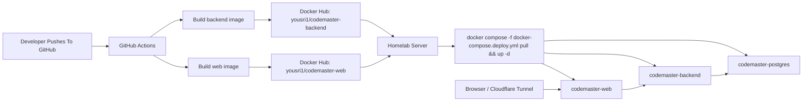

# CodeMaster

CodeMaster is a full-stack coding platform with:
- React + Vite frontend
- FastAPI backend
- Postgres
- Nginx reverse proxy
- Prometheus + Grafana monitoring

## Project Structure

- `client/` frontend
- `backend/` backend API, migrations, tests
- `deploy/` nginx and monitoring configs
- `docker-compose.prod.yml` local image build stack
- `docker-compose.deploy.yml` registry-based deployment stack

## Deployment Diagram



## Local Development

### Clone

```bash
git clone <your-repo-url>
cd CodeMaster
```

### Backend

```bash
cd backend
python -m venv venv
venv\Scripts\activate
pip install -r requirements.txt
```

Create env files from examples:

```bash
copy envs\example.env envs\backend.env
copy envs\pg_example.env envs\pg.env
```

Run API:

```bash
uvicorn src.main:app --reload
```

### Frontend

```bash
cd client
npm install
npm run dev
```

Frontend: `http://localhost:5173`  
Backend: `http://localhost:8000`

## Docker Flows

### 1. Local Build-Based Stack

This builds images from source on the machine where you run Compose.

Linux/macOS:

```bash
make prod-up
```

Windows:

```bash
docker compose -f docker-compose.prod.yml up --build -d
```

### 2. Registry-Based Deployment

This is the standard production pattern: build once, push images to Docker Hub, then pull them on the server.

The repo is set up to publish these images:
- `yousri1/codemaster-backend`
- `yousri1/codemaster-web`

GitHub Actions workflow:
- `.github/workflows/docker-publish.yml`

Required GitHub repository secrets:
- `DOCKERHUB_USERNAME`
- `DOCKERHUB_TOKEN`

Once those secrets are set, every push to `main` will build and push:
- `latest`
- branch/tag refs
- commit SHA tags

### Server Deploy

On the server:

```bash
docker compose -f docker-compose.deploy.yml pull
docker compose -f docker-compose.deploy.yml up -d
```

To pin a specific image tag:

```bash
set CODEMASTER_IMAGE_TAG=sha-xxxxxxxx
docker compose -f docker-compose.deploy.yml pull
docker compose -f docker-compose.deploy.yml up -d
```

The deploy compose file defaults to:
- `yousri1/codemaster-backend:latest`
- `yousri1/codemaster-web:latest`

You can also override the image names:

```bash
set CODEMASTER_BACKEND_IMAGE=yousri1/codemaster-backend
set CODEMASTER_WEB_IMAGE=yousri1/codemaster-web
set CODEMASTER_IMAGE_TAG=latest
```

## Useful Endpoints

- App: `http://localhost`
- Backend health: `http://localhost/healthz`
- Backend metrics: `http://localhost/metrics`
- Prometheus: `http://127.0.0.1:9090`
- Grafana: `http://127.0.0.1:3001`
