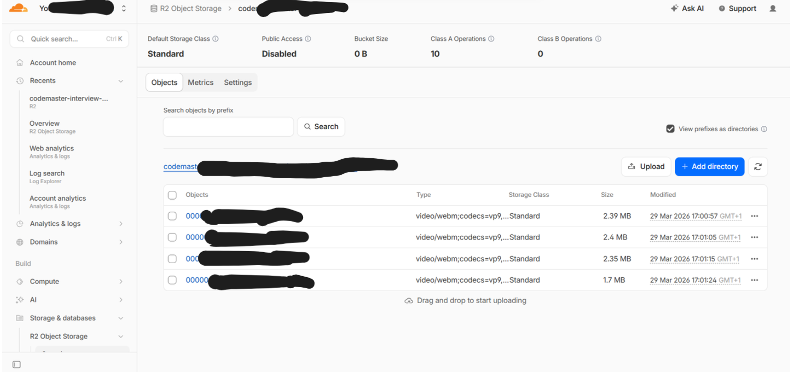
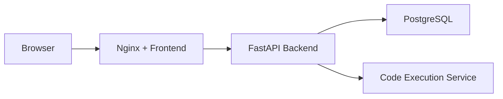
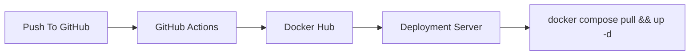

# CodeMaster

CodeMaster is a full-stack coding platform for technical practice and interview workflows. It combines a browser-based coding experience, problem management, code execution, and recruiter-led interview sessions in one system.

The project is built with a React frontend, a FastAPI backend, PostgreSQL for persistence, and an Nginx production layer. It also includes optional monitoring with Prometheus and Grafana, plus Docker-based local and production deployment flows.

## Highlights

- Practice problems with descriptions, constraints, tags, and starter code
- In-browser code editing and submission flows
- Multi-language execution through a Piston-compatible runner
- Cookie-based authentication with refresh rotation and secure logout revocation
- Google and GitHub OAuth login alongside password authentication
- Claim-backed session bootstrap via `/auth/me` without a DB read on the hot path
- User profiles and admin/recruiter access controls
- Recruiter interview creation, candidate invites, interview session tracking, and candidate attempt reset
- Candidate camera/microphone recording with chunk uploads and recruiter review playback
- Production-ready Docker setup with reverse proxy and monitoring

## Demo

Application walkthrough video:

Recommended playback speed: `2x`

<video src="https://github.com/user-attachments/assets/3bc569c0-8181-4888-915b-a8dc9a152649" controls width="100%"></video>

Fallback link:

- [Download the demo video](https://github.com/user-attachments/assets/3bc569c0-8181-4888-915b-a8dc9a152649)

Cloudflare R2 media storage:



## Tech Stack

- Frontend: React, Vite, TypeScript
- Backend: FastAPI, SQLAlchemy, Alembic
- Database: PostgreSQL
- Proxy: Nginx
- Monitoring: Prometheus, Grafana
- Containerization: Docker Compose

## Architecture



## Repository Layout

- `client/` frontend application
- `backend/` API, business logic, migrations, tests
- `deploy/` production Nginx and monitoring configuration
- `docker-compose.prod.yml` local production-like build stack
- `docker-compose.deploy.yml` image-based deployment stack

## Getting Started

### Local Development

Clone the repository:

```bash
git clone https://github.com/yousri-meftah/CodeMaster
cd CodeMaster
```

Backend setup:

```bash
cd backend
python -m venv venv
venv\Scripts\activate
pip install -r requirements.txt
```

Create environment files from the provided examples:

```bash
copy envs\example.env envs\backend.env
copy envs\pg_example.env envs\pg.env
```

Fill the OAuth, JWT, cookie, and upload settings in `backend/envs/backend.env` after copying. The real local env file is intentionally not committed; `backend/envs/example.env` is the template.

Run the API:

```bash
uvicorn src.main:app --reload
```

Frontend setup:

```bash
cd client
npm install
npm run dev
```

Default local URLs:

- Frontend: `http://localhost:5173`
- Backend: `http://localhost:8000`


## Interview Monitoring

Interview sessions support optional candidate media capture for recruiter review.

- Candidates can upload camera/microphone segments during an interview
- Segment metadata is stored in PostgreSQL and media files are stored in Cloudflare R2
- Recruiters can review uploaded recordings and activity logs on separate review pages
- Media warnings such as permission denial or upload failure are logged as activity events
- Recruiter playback is served through backend-controlled presigned download URLs
- Resetting a submitted candidate back to `pending` clears code, logs, media metadata, and uploaded files so the candidate can start fresh on a new invite

### Cloudflare R2 Setup

Candidate interview recordings are now stored in Cloudflare R2 instead of the backend filesystem.

Required backend env values:

```env
R2_ACCOUNT_ID=your_account_id
R2_BUCKET=codemaster-interview-media
R2_ACCESS_KEY_ID=your_access_key_id
R2_SECRET_ACCESS_KEY=your_secret_access_key
R2_ENDPOINT_URL=https://<account_id>.r2.cloudflarestorage.com
R2_REGION=auto
R2_PRESIGNED_URL_TTL_SECONDS=3600
```

Operational notes:

- Create an R2 bucket dedicated to interview media
- Create credentials scoped to that bucket with object read/write permissions
- Keep the bucket private and let the backend generate presigned playback URLs
- Install backend dependencies after pulling the changes so `boto3` is available


## Docker

### Local Production-Like Stack

Build and run the stack locally from source:

Linux/macOS:

```bash
make prod-up
```

Windows:

```bash
docker compose -f docker-compose.prod.yml up --build -d
```

This starts the frontend, backend, PostgreSQL, and optional monitoring services. Database migrations run on container startup.

### Image-Based Deployment

The repository also supports a registry-driven deployment flow where application images are built once and pulled by the target server.

Published images:

- `yousri1/codemaster-backend`
- `yousri1/codemaster-web`

Deployment workflow:



The Docker publish workflow lives in:

- `.github/workflows/docker-publish.yml`

Required GitHub Actions secrets:

- `DOCKERHUB_USERNAME`
- `DOCKERHUB_TOKEN`

Deploy from prebuilt images:

## Monitoring

Optional monitoring is included with:

- Prometheus
- Grafana


## Notes

- Environment-specific values such as database credentials, mail settings, execution service URLs, and compiler paths should be supplied through env files.
- For container deployments, keep server-specific secrets and infrastructure settings outside the repository.
- If you are deploying with prebuilt images, make sure your runtime env files match your server topology.
- The deploy stack now also needs the OAuth env values, auth-cookie settings, and Cloudflare R2 credentials for interview media persistence.
