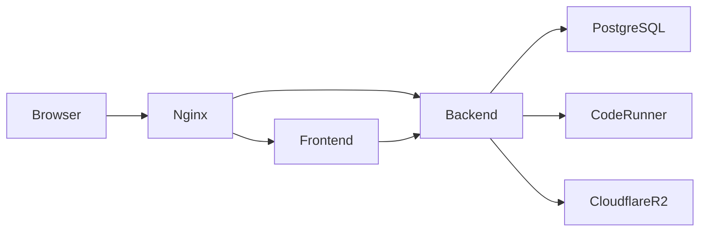

# CodeMaster


---

## 🚀 Overview

CodeMaster is a full-stack coding platform for technical practice and interview workflows.  
It allows users to solve problems, run code, and participate in recruiter-led interviews.

---

## ⚙️ Tech Stack

- **Frontend:** React, Vite, TypeScript  
- **Backend:** FastAPI  
- **Database:** PostgreSQL  
- **Execution:** Code Runner (Piston)  
- **Proxy:** Nginx  
- **Deployment:** Docker Compose  / k8s
- **Monitoring:** Grafana , Prometheus , Loki
- **Storage:** Cloudflare R2  
- **Access:** Cloudflare Tunnel  

---

## 🧱 Architecture




## ⚡ Features

- Code execution in multiple languages  
- Problem solving & submissions  
- User authentication (JWT + OAuth)  
- Recruiter interview system  
- Candidate recording & review  
- Cloud storage (R2) for media  
- Dockerized deployment  

---

## 🐳 Run with Docker

```bash
docker compose up -d --build
```

---

## 🌐 Access

- Frontend → http://localhost  
- Backend → http://localhost/api  

---

## 📊 Monitoring (Optional)

- Grafana dashboard for metrics  

---

## 🔐 Notes

- Configure `.env` before running  
- Keep secrets outside repo  
- Use Cloudflare Tunnel for public access  

---

## 👨‍💻 Author

**Yousri Meftah**
testing pipeline
