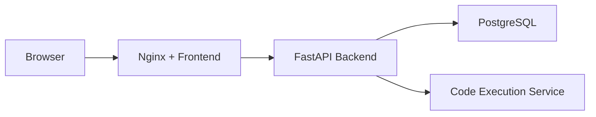
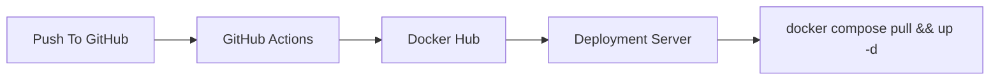

# CodeMaster

CodeMaster is a full-stack coding platform for technical practice and interview workflows. It combines a browser-based coding experience, problem management, code execution, and recruiter-led interview sessions in one system.

The project is built with a React frontend, a FastAPI backend, PostgreSQL for persistence, and an Nginx production layer. It also includes optional monitoring with Prometheus and Grafana, plus Docker-based local and production deployment flows.

## Highlights

- Practice problems with descriptions, constraints, tags, and starter code
- In-browser code editing and submission flows
- Multi-language execution through a Piston-compatible runner
- Cookie-based authentication with refresh rotation and secure logout revocation
- Google and GitHub OAuth login alongside password authentication
- Claim-backed session bootstrap via `/auth/me` without a DB read on the hot path
- User profiles and admin/recruiter access controls
- Recruiter interview creation, candidate invites, interview session tracking, and candidate attempt reset
- Candidate camera/microphone recording with chunk uploads and recruiter review playback
- Production-ready Docker setup with reverse proxy and monitoring

## Demo

Application walkthrough video:

Recommended playback speed: `2x`

<video src="https://github.com/user-attachments/assets/3bc569c0-8181-4888-915b-a8dc9a152649" controls width="100%"></video>

Fallback link:

- [Download the demo video](https://github.com/user-attachments/assets/3bc569c0-8181-4888-915b-a8dc9a152649)

## Tech Stack

- Frontend: React, Vite, TypeScript
- Backend: FastAPI, SQLAlchemy, Alembic
- Database: PostgreSQL
- Proxy: Nginx
- Monitoring: Prometheus, Grafana
- Containerization: Docker Compose

## Architecture



## Repository Layout

- `client/` frontend application
- `backend/` API, business logic, migrations, tests
- `deploy/` production Nginx and monitoring configuration
- `docker-compose.prod.yml` local production-like build stack
- `docker-compose.deploy.yml` image-based deployment stack

## Getting Started

### Local Development

Clone the repository:

```bash
git clone <your-repo-url>
cd CodeMaster
```

Backend setup:

```bash
cd backend
python -m venv venv
venv\Scripts\activate
pip install -r requirements.txt
```

Create environment files from the provided examples:

```bash
copy envs\example.env envs\backend.env
copy envs\pg_example.env envs\pg.env
```

Fill the OAuth, JWT, cookie, and upload settings in `backend/envs/backend.env` after copying. The real local env file is intentionally not committed; `backend/envs/example.env` is the template.

Run the API:

```bash
uvicorn src.main:app --reload
```

Frontend setup:

```bash
cd client
npm install
npm run dev
```

Default local URLs:

- Frontend: `http://localhost:5173`
- Backend: `http://localhost:8000`

## Authentication and Sessions

The web app now uses cookie-based sessions for normal authenticated routes.

- `access_token` is stored in an `HttpOnly` cookie with a short TTL
- `refresh_token` is stored in an `HttpOnly` cookie and rotated on refresh
- `POST /auth/logout` revokes the active refresh token and clears both cookies
- `GET /auth/me` returns the decoded access-token claims for session bootstrap
- Google and GitHub OAuth are supported through backend-managed callback flows

Important frontend rule: do not store auth tokens in `localStorage` and do not send bearer tokens for normal web-session routes.

## Interview Monitoring

Interview sessions support optional candidate media capture for recruiter review.

- Candidates can upload camera/microphone segments during an interview
- Segment metadata is stored in PostgreSQL and media files are stored on disk
- Recruiters can review uploaded recordings and activity logs on separate review pages
- Media warnings such as permission denial or upload failure are logged as activity events
- Resetting a submitted candidate back to `pending` clears code, logs, media metadata, and uploaded files so the candidate can start fresh on a new invite

Interview link validity is anchored to when the invite email is sent, not when the interview record is created.

## Environment Configuration

The backend now expects additional env values for auth, OAuth, and media uploads. See `backend/envs/example.env` for the full template. The main new groups are:

- JWT and cookie settings
  - `ACCESS_TOKEN_EXPIRES_MINUTES`
  - `REFRESH_TOKEN_EXPIRES_DAYS`
  - `JWT_ISSUER`
  - `JWT_AUDIENCE`
  - `ACCESS_TOKEN_COOKIE_NAME`
  - `REFRESH_TOKEN_COOKIE_NAME`
  - `AUTH_COOKIE_SECURE`
  - `AUTH_COOKIE_SAMESITE`
  - `AUTH_COOKIE_DOMAIN`
  - `AUTH_COOKIE_PATH`
- OAuth settings
  - `OAUTH_BACKEND_BASE_URL`
  - `OAUTH_FRONTEND_BASE_URL`
  - `OAUTH_FRONTEND_CALLBACK_PATH`
  - `GOOGLE_OAUTH_CLIENT_ID`
  - `GOOGLE_OAUTH_CLIENT_SECRET`
  - `GITHUB_OAUTH_CLIENT_ID`
  - `GITHUB_OAUTH_CLIENT_SECRET`
- Interview uploads
  - `INTERVIEW_MEDIA_UPLOAD_ROOT`

OAuth callback URLs must exactly match your backend base URL:

- Google: `${OAUTH_BACKEND_BASE_URL}/auth/oauth/google/callback`
- GitHub: `${OAUTH_BACKEND_BASE_URL}/auth/oauth/github/callback`

## Frontend Integration Contract

The backend-facing frontend contract for the new auth and interview-media APIs is documented in:

- `backend/docs/frontend-auth-and-interview-media-contract.md`

It describes request and response shapes, cookies, status codes, retry behavior, OAuth callback handling, and media upload expectations.

## Validation

Run these before shipping:

Backend:

```bash
cd backend
python -m pytest
```

Frontend:

```bash
cd client
npm run build
```

## Docker

### Local Production-Like Stack

Build and run the stack locally from source:

Linux/macOS:

```bash
make prod-up
```

Windows:

```bash
docker compose -f docker-compose.prod.yml up --build -d
```

This starts the frontend, backend, PostgreSQL, and optional monitoring services. Database migrations run on container startup.

### Image-Based Deployment

The repository also supports a registry-driven deployment flow where application images are built once and pulled by the target server.

Published images:

- `yousri1/codemaster-backend`
- `yousri1/codemaster-web`

Deployment workflow:



The Docker publish workflow lives in:

- `.github/workflows/docker-publish.yml`

Required GitHub Actions secrets:

- `DOCKERHUB_USERNAME`
- `DOCKERHUB_TOKEN`

Deploy from prebuilt images:

```bash
docker compose -f docker-compose.deploy.yml pull
docker compose -f docker-compose.deploy.yml up -d
```

To deploy a pinned image tag:

```bash
set CODEMASTER_IMAGE_TAG=sha-xxxxxxxx
docker compose -f docker-compose.deploy.yml pull
docker compose -f docker-compose.deploy.yml up -d
```

## Monitoring

Optional monitoring is included with:

- Prometheus
- Grafana

Default endpoints when enabled:

- Application: `http://localhost`
- Health check: `http://localhost/healthz`
- Metrics: `http://localhost/metrics`
- Prometheus: `http://127.0.0.1:9090`
- Grafana: `http://127.0.0.1:3001`

## Notes

- Environment-specific values such as database credentials, mail settings, execution service URLs, and compiler paths should be supplied through env files.
- For container deployments, keep server-specific secrets and infrastructure settings outside the repository.
- If you are deploying with prebuilt images, make sure your runtime env files match your server topology.
- The deploy stack now also needs the OAuth env values, auth-cookie settings, and an upload path or volume for interview media persistence.
