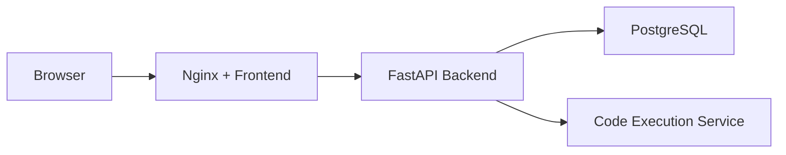

# CodeMaster

---

# CodeMaster

CodeMaster is a full-stack coding platform designed for technical practice and coding interviews. It provides an online coding environment, problem management, secure authentication, recruiter-managed interview sessions, and candidate activity monitoring in a single system.

Built with React, FastAPI, PostgreSQL, Docker, and Nginx, the platform supports both learning and hiring workflows while offering production-ready deployment and monitoring capabilities.

## Features

- Online code editor and submission system
- Multi-language code execution
- Practice problems with tags, constraints, and starter code
- JWT authentication with secure cookie sessions
- Google and GitHub OAuth login
- User, recruiter, and admin roles
- Recruiter-created coding interviews and candidate invitations
- Candidate progress tracking and attempt management
- Camera and microphone recording during interviews
- Cloudflare R2 media storage for interview recordings
- Dockerized infrastructure with monitoring support

## Demo

Recommended playback speed: **2x**

<video src="https://github.com/user-attachments/assets/3bc569c0-8181-4888-915b-a8dc9a152649" controls width="100%"></video>

**Video Download:**  
[Download Demo](https://github.com/user-attachments/assets/3bc569c0-8181-4888-915b-a8dc9a152649)

## Cloudflare R2 Storage

Interview recordings and media uploads are stored in Cloudflare R2 and accessed through secure backend-generated presigned URLs.

## Tech Stack

- **Frontend:** React, TypeScript, Vite
- **Backend:** FastAPI, SQLAlchemy, Alembic
- **Database:** PostgreSQL
- **Infrastructure:** Docker, Docker Compose, Nginx
- **Monitoring:** Prometheus, Grafana
- **Storage:** Cloudflare R2

## Architecture

## Monitoring

Optional monitoring is included through Prometheus and Grafana for infrastructure and application observability.
